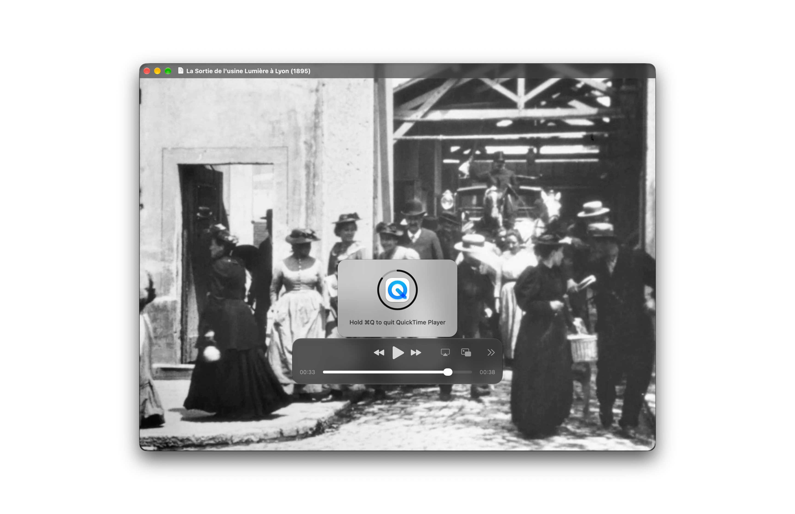

<picture><source media="(prefers-color-scheme: dark)" srcset="docs/icon-github-dark.png"></picture>

# HoldQ

Quit protection for Mac. ⌘Q quits an app only when held for a second.

<picture><source media="(prefers-color-scheme: dark)" srcset="docs/scene.webp"></picture>

Apple silicon, macOS 13 or later.

## Install

```sh
brew install geragarazagh/tap/holdq
```

Or download [`HoldQ.dmg`](https://github.com/geragarazagh/holdq/releases/latest/download/HoldQ.dmg).
